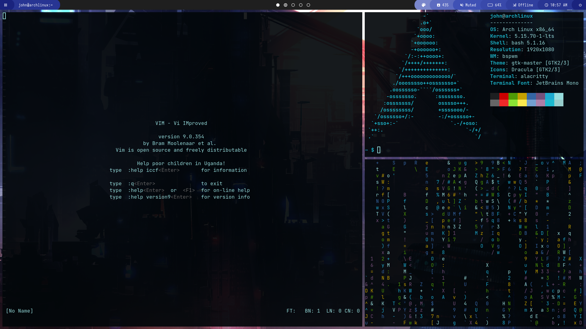

# Arch config

### About
Configs are created and stored for my personal use. <br>
The shell scripts must work for the most distros. Btw, there's an **Install**
section down below.

### Programs I use:
* ***bspwm*** as WM
* ***sxhkd*** as hotkey deamon
* ***polybar*** as status bar
* ***picom*** as composite manager
* ***alacritty*** as the terminal emulator
* ***pywal*** for colorscheme (sometimes)
* ***bash*** as the shell
* ***vim*** as the main text editor

### Install
Firstly, move to the repo directory:
```bash
cd Arch_config
```
Configs installation is pretty simple::
```bash
(sudo) ./post-install.sh
./config_setup.sh
```
Where *post-install.sh* installs all of the packages from packages.dat and also
some python pip modules. *config_setup.sh* should be used with
caution as it rewrites bspwm, sxhkd, alacritty, and polybar configuration files,
and also may apply pywal colorscheme and wallpaper.
<br><br>
Other dotfiles (except .vimrc) must be moved manually into the user's home
directory (for the sake of safety I didn't add this in the script):
```bash
cp -r configs/.*rc $HOME/
```
